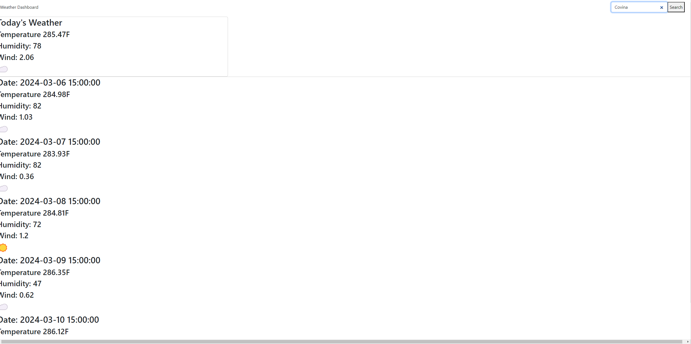

# weather-server-api
The weather api shows has a search bar where you can search up a city that you want the current and 5-day forecast. The weather cards popup with current weather and 5-day forecast. The data is pulled from a weather api where the information displayed is pulled from the api such as date, weather, temperature, wind, and humidity.

image: 

Deployment: https://willieyeh1.github.io/weather-server-api/
